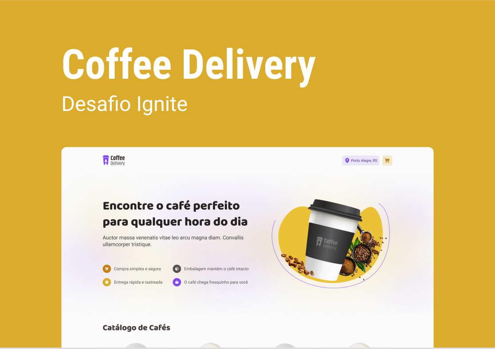

<h1 align="center">
  Coffee Delivery ☕
</h1>

<p align="center">
  <a href="#-sobre-o-projeto">Projeto</a>&nbsp;&nbsp;&nbsp;|&nbsp;&nbsp;&nbsp;
  <a href="#-conceitos-utilizados-no-desenvolvimento">Conceitos</a>&nbsp;&nbsp;&nbsp;|&nbsp;&nbsp;&nbsp;
  <a href="#-tecnologias-utilizadas">Tecnologias</a>&nbsp;&nbsp;&nbsp;|&nbsp;&nbsp;&nbsp;
  <a href="#-como-executar-o-projeto">Executar o projeto</a>&nbsp;&nbsp;&nbsp;|&nbsp;&nbsp;&nbsp;
  <a href="#-licença">Licença</a>
</p>

# 🚧 Sobre o projeto

Preview: https://coffee-delivery-joaosam.vercel.app/

Esse projeto tem como objetivo, a criação de uma aplicação para gerenciar um carrinho de compras de uma cafeteria fictícia.

## 🛠️ Funcionalidades

- Salva os pedidos no local Storage
- Navegação entre as páginas sem perder os cafés selecionados
- Valida valores dos inputs do formulário
- Responsivo para versões mobile

# 📚 Conceitos Utilizados no Desenvolvimento

- Principal conceito foi a utilização do hook useContext, fazendo com que a aplicação tenha acesso a informações em todas as páginas
- Utilização do react-router-dom para navegação das páginas
- Criado formulário com react-hook-form e validação com o Yup

## 🎨 Layout



# 🚀 Tecnologias utilizadas

- TypeScript
- ReactJS
- Styled Components
- Jest (Testes unitários sendo construídos)

# 💻 Como executar o projeto

Pré-requisitos: npm / yarn

```bash
# Clonar repositório
git clone https://github.com/Joaosam/coffee-delivery.git

# Navegar até a pasta
cd coffee-delivery

# Instalar dependências
npm install

# Executar o projeto
npm run dev
```

## 📝 Licença

Esse projeto está sob a licença MIT. Veja o arquivo [LICENSE](LICENSE) para mais detalhes.
[](https://github.com/Joaosam/coffee-delivery/blob/main/LICENSE)

<br />

---

Feito com ♥ by Joaosam
